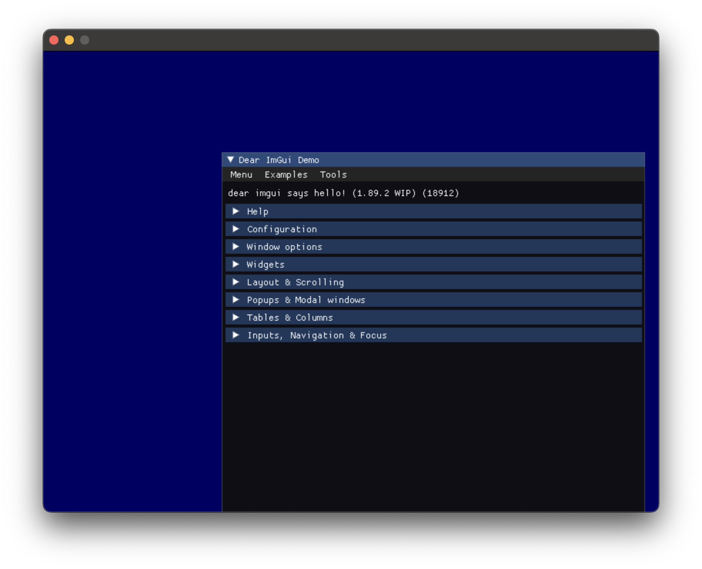

# CMake SDL2 ImGui

### Requirements:

- `$ brew install cmake`
- `$ brew install sdl2`
- `$ brew install sdl2_ttf`
- `$ brew install sdl2_image`
- `$ brew install sdl2_mixer`

### Submodules:

- [FindImgui](https://github.com/developer239/cmake-modern-findimgui-sdl)
- [FindSDL2](https://github.com/opeik/cmake-modern-findsdl2)
- [ImGui](https://github.com/ocornut/imgui)

In the future I would like to load SDL2 from submodule as well in order to avoid global dependencies. Pull requests are welcomed.

## Preview

